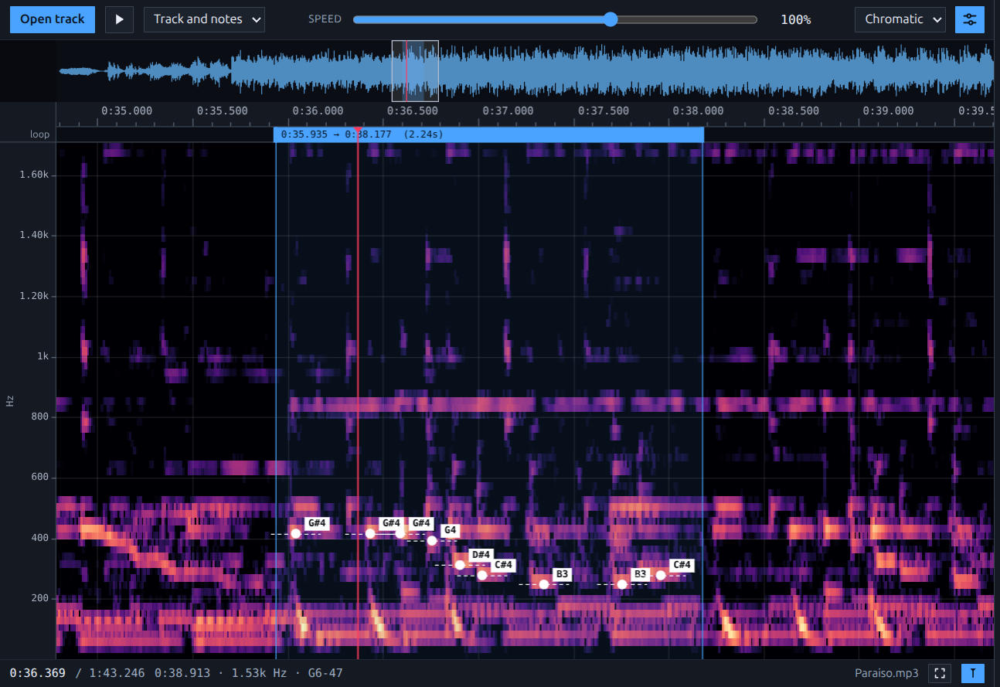

# Slower!

Try it now at https://slower.jmat.it  
  

Slower! is a browser-based audio practice tool and a Transcribe! alternative for slowing down music without changing pitch. It lets you open a local track, inspect it in a spectrogram, loop sections, place markers, and pin notes.

## Main features

- Local file playback from your browser, no upload required
- Variable-speed playback with pitch preserved
- Navigable spectrogram view with zoom, pan, and frequency scaling
- Looping over any region of the track
- Markers for musical sections or reference points
- Pinned notes tied to time and pitch
- Beat grid: tap two beats and it fills the track, then new notes and loop edges snap to it
- Notes-only, track-only, or track-plus-notes playback modes
- Session memory for re-opening the last state of a track
- Export/import in a single `.tsa` archive: the audio plus cursor, selection,
  markers, pinned notes, beat grid, view and settings

## Stretch algorithms

Slowing music down is where these tools live or die, so the player is selectable
in the Menu. Four of them, with genuinely different characters:

- **Signalsmith** (default) — the [Signalsmith Stretch](https://signalsmith-audio.co.uk/code/stretch/)
  library, MIT, running as WASM. Purpose-built for this job and the one that holds
  up furthest down: no roughness and attacks still intact.
- **WSOLA** — waveform-similarity overlap-add, in-house: copies pieces of the
  waveform and splices them where they match. Attacks stay sharp, sustained notes
  get rough as the rate drops.
- **Phase vocoder** — in-house, phases locked to the spectral peaks: never rough
  however far down you go, at the cost of softer attacks.
- **Smear** — the PaulStretch idea, in-house: long window, phase of every bin
  randomised. Measurably the noisiest of the four and no transients survive, but
  the pitches stay legible at 20% and nothing ever sounds gritty.

`node scripts/stretch-quality.mjs 0.3` renders each one offline at 30% and
measures it:

| player | chord | one instrument | pre-echo | hits | cost |
|---|---|---|---|---|---|
| Signalsmith | 0.2% | 0.5% | 18%* | 2 | 237 ms |
| WSOLA | 18.3% | 0% | 0.2% | 2 | 167 ms |
| Phase vocoder | 0% | 0% | 5.5% | 5 | 280 ms |
| Smear | 59.1% | 52.3% | 55.5% | 7 | 239 ms |

*chord* and *one instrument* are the share of output energy that is not on a
partial of the input — roughness and warble land there. *pre-echo* is how much of
an attack leaks out before it happens, *hits* how many times a single hit comes
out. *cost* is wall time to render 3 s. \* the pre-echo figure is not comparable
for Signalsmith: it aligns its output differently, so the window the metric looks
at does not mean the same thing.

The live suite (`scripts/smoke.mjs`) also checks that each player really slows
down by the rate it was asked for, loop after loop — the metric that catches a
stretcher quietly running at the wrong speed.

Two more were tried and dropped: period-locked splices (PSOLA) measured well but
were indistinguishable from WSOLA by ear, and a transient-aware vocoder that
played attacks at 1x made the speed lurch between full and a standstill.

### The vendored library

`public/vendor/SignalsmithStretch.js` is a byte-for-byte copy of the npm package,
refreshed with `node scripts/vendor.mjs`, and it is loaded at runtime rather than
imported. That is deliberate: the library builds its own AudioWorklet by
stringifying its own functions, so a bundler that renames identifiers produces a
worklet that never starts.

The extension is `.js`, not the upstream `.mjs`: nginx and plenty of other static
servers have no type for `.mjs` and answer `application/octet-stream`, which the
browser refuses as a module script. `docker/nginx.conf` also maps `.mjs` for good
measure.

Rubber Band would be the other strong candidate but it is GPL, which an MIT app
cannot ship; the `paulstretch` npm package processes whole files offline, so it
cannot follow a speed slider.

## Beat grid

Open the side menu and press **Edit time grid**. A bar appears at the top left of the
plot while the grid is being edited:

1. Click the first beat.
2. Click the next one - the spacing is measured and beats are laid across the whole track.

From then on every beat can be dragged, and that is the point: an error on the length of
one beat piles up bar after bar, so it is on the *last* beat that it is big enough to see
and take out. The first beat carries the whole grid; any other one sets the spacing with
the first as the anchor, so dragging the twelfth beat moves the tempo by a twelfth of the
distance you dragged. The bar shows the beat length and the tempo it comes to, to line the
last beat up on a number.

**Save grid** locks it in, **Clear** drops the grid and starts over, **Cancel** puts back
the grid you had.

*Grid division* picks how many lines fill a beat, from `1/1` (beats only) to `1/32`.
With *Magnet notes* on, a newly pinned note and each loop edge land on the nearest line;
notes already placed are never moved.

## Measurement tools

- `node scripts/smoke.mjs` - end to end run of the interface, headless
- `node scripts/archive-check.mjs` - exports a `.tsa`, reads its header from the raw
  bytes and imports it into a session wiped clean: state in must equal state out
- `node scripts/sync-check.mjs` - times a click of the track against the reference
  note pinned on it, for every engine and a few speeds: it says whether what you
  see is what you hear
- `node scripts/stretch-quality.mjs [rate]` - artefacts of the four stretch engines
- `node scripts/bench.mjs` - analysis throughput

## Shortcuts

- `Space` - play / pause
- `Esc` - clear the current loop or close the menu
- `A` / `B` - set loop start / end at the cursor
- `M` - add a marker at the cursor
- `Left` / `Right` - seek by 1 second, or 5 seconds with `Shift`
- `+` / `-` - zoom time
- `0` - fit the whole track
- `F` - follow the cursor

## License

MIT - see [LICENSE](LICENSE). Source: [github.com/jonamat/Slower](https://github.com/jonamat/Slower)

Third-party: [Signalsmith Stretch](https://www.npmjs.com/package/signalsmith-stretch)
(MIT), vendored in `public/vendor`.
